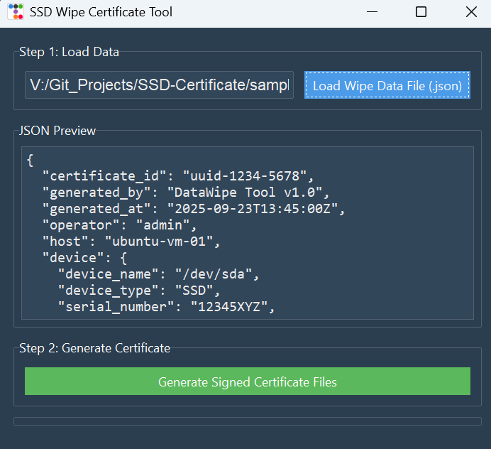

# SSD Wipe Certificate Tool

> A desktop application to securely generate digitally signed certificates of data destruction from JSON wipe logs.

This tool provides a secure and user-friendly way to certify that a storage device has been properly sanitized. It takes a JSON file containing the details of a wipe process and produces two verifiable artifacts: a cryptographically signed JSON file (using JWS) and a digitally signed PDF certificate for official records.

---

## Features

* **Modern UI:** A clean, dark-themed interface built with `ttkbootstrap`.
* **JSON Signing:** Creates a tamper-evident signed JSON file using the industry-standard JSON Web Signature (JWS).
* **PDF Signing:** Generates a human-readable PDF certificate with a real cryptographic signature that can be validated by PDF readers like Adobe Acrobat.
* **Simple Workflow:** Load a file, click a button, and get your secure certificates.

---

## Screenshot




---

## Prerequisites

Before you begin, ensure you have the following installed on your system:

* Python 3.8+
* pip (Python's package installer)
* **OpenSSL** (for generating the necessary security keys)

---

## Setup and Installation

Follow these steps to get the application running on your local machine.

1.  **Clone the repository:**
    ```bash
    git clone [https://github.com/your-username/your-repository-name.git](https://github.com/your-username/your-repository-name.git)
    cd your-repository-name
    ```

2.  **Install Python dependencies:**
    Use the `requirements.txt` file to install all the necessary libraries.
    ```bash
    pip install -r requirements.txt
    ```

3.  **Generate Security Keys:**
    You need to generate a private key and a self-signed certificate. Run the following command in the project's root directory:
    ```bash
    openssl req -newkey rsa:2048 -nodes -keyout key.pem -x509 -days 365 -out cert.pem
    ```
    This will create `key.pem` and `cert.pem` files.

---

## How to Use

1.  **Run the application:**
    ```bash
    python main.py
    ```

2.  **Load Data:**
    Click the **"Load Wipe Data File (.json)"** button and select your input file. A sample input file, `sample-wipe-data.json`, is included in this repository for testing.

3.  **Generate Certificates:**
    Once the data is loaded and displayed, click the **"Generate Signed Certificate Files"** button.

4.  **Save Files:**
    A save dialog will appear. Choose a location and base name for your files. The application will output two files:
    * `your-chosen-name-signed.json`
    * `your-chosen-name.pdf`

---

## ⚠️ Security Note

The `.gitignore` file is configured to prevent you from accidentally committing your private key (`key.pem`) to the repository.

**NEVER** share or commit your `key.pem` file. It is your secret key and must be kept private.

---

## Key Technologies Used

* [ttkbootstrap](https://ttkbootstrap.readthedocs.io/en/latest/) - For the modern UI theme.
* [ReportLab](https://www.reportlab.com/opensource/) - For generating the PDF document.
* [pyhanko](https://pyhanko.readthedocs.io/en/stable/) - For applying cryptographic signatures to PDFs.
* [python-jose](https://github.com/mpdavis/python-jose) - For signing JSON data with the JWS standard.
